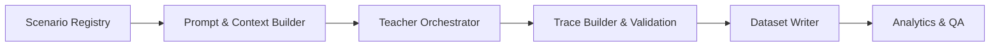

# Agentic Distillation Framework

This repository provides a modular framework for distilling high-agency behavioural traces from a frontier model into curated training data for smaller instruction-following models. The framework **only generates datasets**; it does not perform any fine-tuning or optimisation, keeping the distillation and training concerns cleanly separated. The focus is on producing tool-use intensive, multi-step decision traces aligned with benchmarks such as TerminalBench, T^2 Bench, and telecom-themed customer support tasks while enforcing an English-first, Chinese-supported language policy.

## High-Level Architecture

1. **Scenario Registry**  
   Describes the agentic situations we want to elicit (e.g., terminal troubleshooting, telco customer care). Each scenario template captures goals, environment assumptions, tool availability, and evaluation rubrics.
2. **Teacher Orchestrator**  
   Wraps the powerful API (OpenAI, Anthropic, etc.), handles prompt assembly, retries, and optional self-reflection passes to obtain high-quality trajectories.
3. **Trace Builder**  
   Normalizes raw teacher responses into structured episodes: system prompt, user turns, tool invocations, assistant rationales, and final answers. An extensible validator scores outputs against per-scenario rubrics.
4. **Dataset Writer**  
   Streams validated traces into JSONL or Parquet shards, along with metadata (scenario ID, difficulty, score, reflection). Supports incremental refresh and deduplication.
5. **Analytics & QA**  
   Lightweight notebooks/scripts for cohort analysis (coverage across capabilities, score distributions) and automatic spot checks to maintain quality.



## Key Features

- **Agentic Focus:** Scenario templates emphasise tool choice, decision branching, and intermediate reasoning states rather than one-shot responses.
- **Multi-Model Pools:** Weighted teacher and reviewer pools let you mix several frontier endpoints, biasing toward preferred models while retaining fallbacks.
- **Reviewer Refinement:** A second model scores each trace, drives auto-refinement, and enforces strict acceptance thresholds.
- **Language Guardrails:** Global prompts ensure outputs stay primarily in English with succinct Chinese summaries when useful.
- **Parallelised Sampling:** Configurable thread pools keep several scenarios distilling simultaneously for higher throughput.
- **Extensible Storage:** Pluggable sinks for JSONL (default), Parquet, or direct uploads to object stores.
- **Benchmark Hooks:** Predefined scenario families inspired by TerminalBench, T^2 Bench, and telecom support flows, ready for expansion.

## Quick Start

1. Install dependencies:
   ```bash
   pip install -e .
   ```
2. Configure your teacher/reviewer pools (see `configs/teacher.example.yaml` for structure).
3. Define a scenario mix and run settings (see `configs/run.terminal.yaml`).
4. Run the distillation loop:
   ```bash
   python scripts/run_distillation.py --config configs/run.terminal.yaml
   ```

The script will produce JSONL shards under `data/exports/` containing fully validated episodes.

### Configuration Highlights

- `teacher_pool` and `reviewer_pool` describe weighted sets of endpoints. Use `preferred_order` to bias toward your favourite model while keeping alternates ready.
- `review_flow` toggles reviewer scoring, minimum score thresholds, and the number of automated refinement rounds.
- `prompts` injects consistent guidance for teachers and reviewers, including the English-first + Chinese recap requirement.
- `concurrency.max_workers` controls how many scenarios run in parallel; tune it to match your API throughput budget.
- Each scenario template can pin custom parameters while inheriting the global language and quality guardrails.

### Verifying Output Quickly

- Peek at the first few samples:
  ```bash
  head -n 2 data/exports/terminal/shard-00000.jsonl | jq .
  ```
- Confirm scenario coverage, reviewer acceptance rates, and discard reasons via logs emitted during the run.
- Ensure the language mix meets expectations (English narratives with optional Chinese recaps).
- Use the QA checklist (`docs/qa_checklist.md`) after each batch.

## Repository Layout

- `src/agentic_distill/` - Python package with core framework modules.
- `configs/` - Example configs for teacher endpoints and scenario mixes.
- `scripts/` - Entry points for batch distillation and analytics.
- `docs/` - Extended documentation (architecture notes, QA checklist).
- `data/` - Output location for generated datasets (gitignored).

## Next Steps

- Add additional scenario families (finance operations, enterprise IT).
- Integrate automated reward models for finer-grained scoring.
- Hook into evaluation harnesses to automatically re-run TerminalBench/T^2 Bench after each distillation batch.
