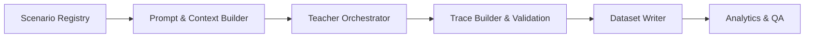

# Agentic Distillation 框架（中文）

此仓库提供了一个模块化框架，用于将高自治（high-agency）行为轨迹从前沿模型蒸馏为用于更小的遵从指令模型的经过整理的训练数据。该框架**仅生成数据集**；不进行任何微调或优化，从而将蒸馏与训练清晰分离。重点是产生以工具使用为主、包含多步骤决策轨迹的样本，适配像 TerminalBench、T^2 Bench 以及电信客服场景等基准。
同时框架执行“英文优先、中文辅助”的语言策略（English-first, Chinese-supported）。

## 高层架构

1. **场景注册（Scenario Registry）**
   描述我们希望引导出的 agentic 情形（例如终端故障排查、电信客服）。每个场景模板捕获目标、环境假设、可用工具和评估量表。
2. **Teacher 协调器（Teacher Orchestrator）**
   封装强大模型的 API（OpenAI、Anthropic 等），负责提示（prompt）构建、重试机制和可选的自我反思（self-reflection）步骤以获取高质量轨迹。
3. **轨迹构建器（Trace Builder）**
   将原始 teacher 响应标准化为结构化的回合：system 提示、用户回合、工具调用、助理推理（rationales）、以及最终答案。可扩展的验证器根据每个场景的量表对输出打分。
4. **数据集写入器（Dataset Writer）**
   将验证通过的轨迹流式写入 JSONL 或 Parquet 分片，并附带元数据（场景 ID、难度、得分、反思）。支持增量刷新和去重。
5. **分析与质检（Analytics & QA）**
   轻量化的 notebook/脚本用于队列分析（能力覆盖、得分分布）和自动抽查以维持质量。



## 主要特性

- **Agentic 聚焦：** 场景模板强调工具选择、决策分支和中间推理状态，而非一次性回答。
- **多模型池（Multi-Model Pools）：** 支持加权的 teacher 与 reviewer 池，可以混合多个前沿端点，并能按偏好顺序倾斜使用。
- **审核者精炼（Reviewer Refinement）：** 使用第二模型为每条轨迹打分，驱动自动精炼流程并强制执行严格的接受阈值。
- **语言护栏（Language Guardrails）：** 全局提示确保输出主要以英文为主，同时在有用时提供简洁的中文摘要。
- **并行采样（Parallelised Sampling）：** 可配置的线程/任务池允许并行蒸馏多个场景以提高吞吐量。
- **可扩展存储：** 可插拔的输出目标，支持 JSONL（默认）、Parquet，或直接上传至对象存储。
- **基准钩子：** 预定义的场景族受 TerminalBench、T^2 Bench 与电信支持流程启发，可继续扩展。
- **配置驱动：** 通过 YAML/TOML 配置文件映射场景混合、采样配额、teacher/reviewer 参数与输出位置。

## 快速开始

1. 安装依赖：

   ```bash
   pip install -e .
   ```

2. 配置 teacher 模型的凭证（参见 `configs/teacher.example.yaml`）。
3. 定义场景混合（参见 `configs/run.terminal.yaml`）。
4. 运行蒸馏循环：

   ```bash
   python scripts/run_distillation.py --config configs/run.terminal.yaml
   ```

脚本会在 `data/exports/` 下生成 JSONL 分片，包含已验证的完整回合样本。

### 配置要点

- `teacher_pool` 与 `reviewer_pool` 描述了带权重的端点集合。使用 `preferred_order` 来偏向首选模型，同时保留备选。
- `review_flow` 控制是否启用审核者评分、最小接受分数阈值，以及自动精炼轮数。
- `prompts` 注入对 teacher 与 reviewer 的一致性指引，包括英文优先并辅以中文摘要的要求。
- `concurrency.max_workers` 控制并行运行的场景数量；根据你的 API 吞吐预算进行调整。
- 每个场景模板可以在继承全局语言与质量护栏的同时，固定自定义参数。

### 快速验证输出

- 查看前几条样本：

```bash
head -n 2 data/exports/terminal/shard-00000.jsonl | jq .
```
 
- 确认场景覆盖率、审核者接受率与丢弃原因（通过运行时日志）。
- 确认语言混合是否符合预期（以英文叙述为主，必要时有中文简要回顾）。
- 每批次之后，使用 QA checklist（`docs/qa_checklist.md`）进行人工/自动抽查。

### 元数据一览

每个回合（episode）现在在 `metadata.generation` 下存储了结构化的生成元数据，示例如下：

```json
{
   "generation": {
      "run_name": "mcp-batch-001",
      "teacher": {
         "endpoint": "frontier-default",
         "provider": "openai",
         "model": "gpt-4.1",
         "temperature": 0.16,
         "top_p": 0.9,
         "max_output_tokens": 3584
      },
      "review": [
         {"round": 0, "reviewer_endpoint": "reviewer-judge", "reviewer_model": "gpt-4.1-mini", "score": 0.92}
      ],
      "reflection_passes": 2,
      "seed": 1234
   },
   "scenario_type": "mcp_integration",
   "language_policy": "en-primary zh-secondary",
   "validation_feedback": "Balanced tool analysis with metadata block."
}
```

使用该元数据块可追踪哪个模型生成或审核了每条轨迹，并可按场景类型或语言策略进行过滤。

## 仓库结构

- `src/agentic_distill/` - 框架核心模块的 Python 包。
- `configs/` - teacher 端点与场景混合的示例配置。
- `scripts/` - 批量蒸馏与分析的入口脚本。
- `docs/` - 扩展文档（架构注释、QA 清单）。
- `data/` - 生成数据集的输出位置（通常被 git 忽略）。

## 后续计划

- 添加更多场景族（金融操作、企业 IT 等）。
- 集成自动化奖励模型以实现更细粒度的评分。
- 将评估框架接入评测工具链，以便在每次蒸馏后自动重新运行 TerminalBench/T^2 Bench。
